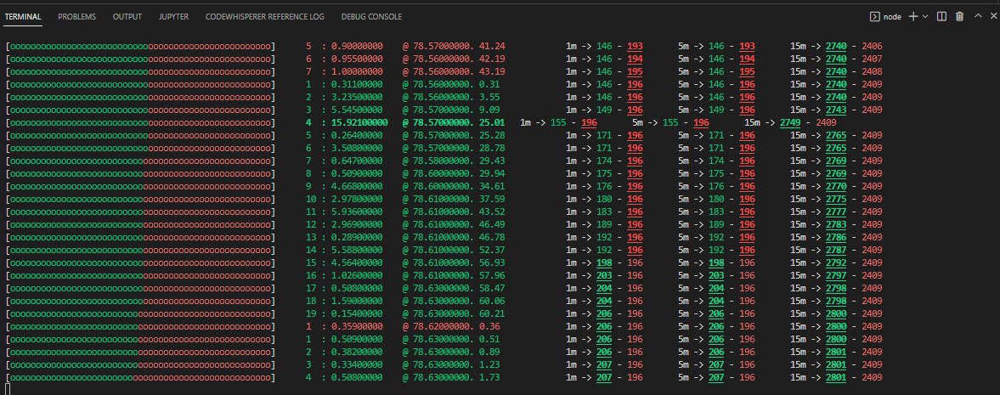

# Binance trades monitor.
This Small app receives the binance trades stream and shows them in a meaningful way in the console.

It shows coloured trades for buy and sell and will highlight high volume trades (trades over 10 for now)

Tochange the currency displayed, set it in the index.js file.

## How to get started
`npm install`

`npm run start`

You may need to install nodemon if you want the app to detect changes and automatically restart. If you do not want this, simply run

`npm run start:nowatch'

## output
Range meter | number of concurrent trade types | buy/sell (maker) | qty of trade | price | running total qty of trade type |

I hope to add to this in the future, for now, happy trading.

